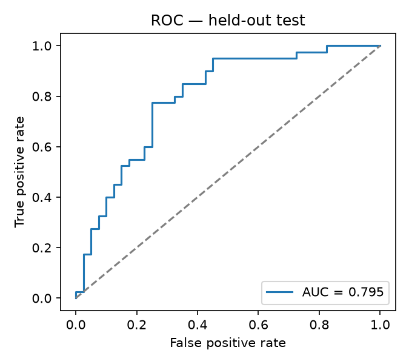
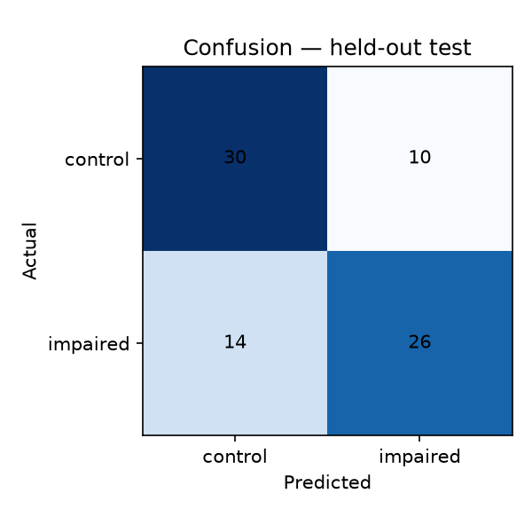

# PROCESS-2 evaluation results

Model: **logistic** · 35 markers · 400 recordings

## Held-out official test split

- AUC-ROC: **0.795**
- F1: 0.684  ·  Accuracy: 0.700
- n = 80 ( +40 impaired )
- Confusion [[TN,FP],[FN,TP]]: [[30, 10], [14, 26]]

## Speaker-independent cross-validation (training portion)

- AUC-ROC: **0.661**  ·  F1: 0.610  ·  Acc: 0.628

## Marker-family ablation (CV AUC, each family alone)

| Family | # markers | AUC |
| --- | --- | --- |
| coherence | 6 | 0.681 |
| timing | 12 | 0.659 |
| grammar | 9 | 0.585 |
| vocabulary | 8 | 0.584 |

_Screening research demo. Not a diagnosis. Speaker-independent splits throughout._