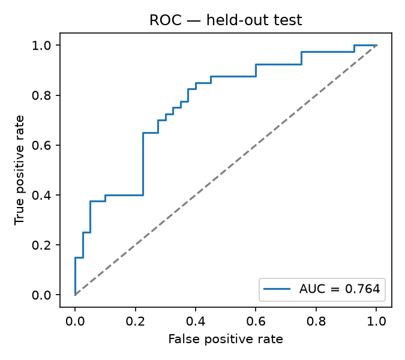
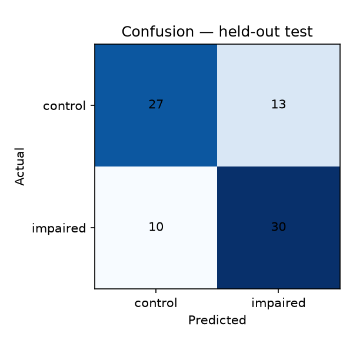

# PROCESS-2 evaluation results

Model: **xgboost** · 35 markers · 400 recordings

## Held-out official test split

- AUC-ROC: **0.764**
- F1: 0.723  ·  Accuracy: 0.713
- n = 80 ( +40 impaired )
- Confusion [[TN,FP],[FN,TP]]: [[27, 13], [10, 30]]

## Speaker-independent cross-validation (training portion)

- AUC-ROC: **0.642**  ·  F1: 0.586  ·  Acc: 0.594

## Marker-family ablation (CV AUC, each family alone)

| Family | # markers | AUC |
| --- | --- | --- |
| grammar | 9 | 0.642 |
| coherence | 6 | 0.615 |
| timing | 12 | 0.580 |
| vocabulary | 8 | 0.552 |

_Screening research demo. Not a diagnosis. Speaker-independent splits throughout._